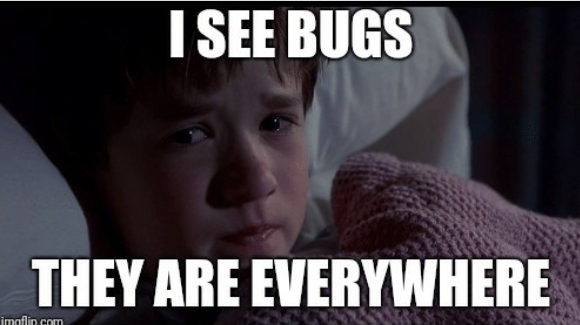
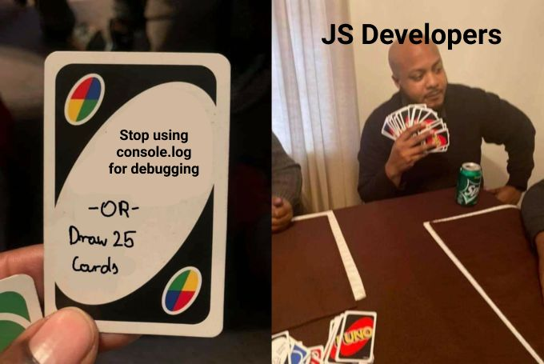
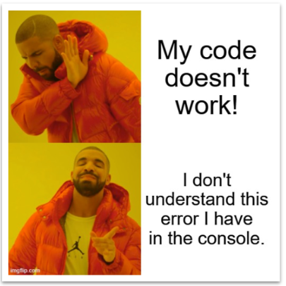
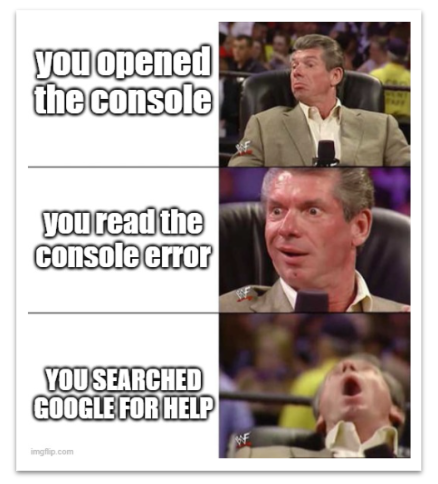

# Debugging

---

True or false? A programmer spends almost all their time writing code.

Writing code is only one of the many things that a programmer does. We spend lots of time doing other things as well:
- Reading documentation
- Reading code
- Researching (googling)
- **Debugging code**

---



Bugs, bugs, bugs! Where do they come from?
- Typos (probably the hardest to fix).
- Forgetting to pass an argument.
- Passing the wrong type of data as an argument.
- Making wrong assumptions (due to bad naming).
- A million other things.

---

## Exceptions

In most cases, a bug will cause your code to crash. **This is a GOOD thing!**

When the code crashes, it comes with an error message that tells you:
- What the problem is.
- Where the problem is.

It's then up to you to figure out why the problem is.

---

## Debugging 101

Sometimes, even though the error message helps us, we can't find the bug. Or in a few rare cases, we won't even get an error message!

In some even more rare cases, the error message could be wrong because even the code isn't sure what's causing the error! 😱

What can we do in that situation?

```js
console.log()
```

Logging things into the console is one of the quickest and easiest ways to find a bug!

---

Learning to use `console.log()` effectively is an essential part of becoming a developer.

It allows you to be independent!



---

**Always check the console.**

**Always read the error messages.**

**It should be your first reflex.**



---

Use your Google-fu!
- Search for the error message.
- Be skeptical.
- Skim results.

